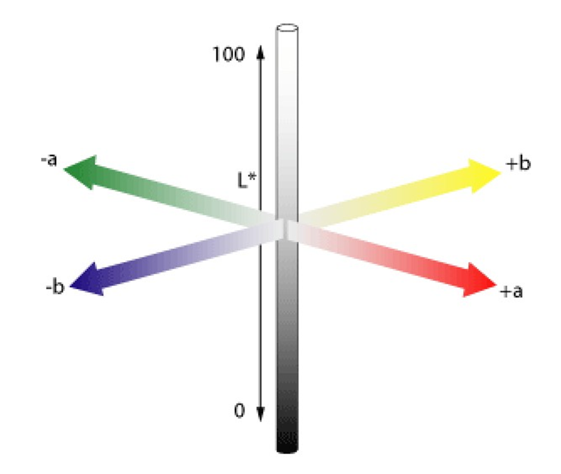
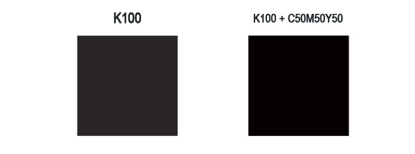

# Цветовые режимы
## Lab
Режим Lab основан на человеческом восприятии цвета в зависимости от других цветов, окружающих его

`L - Lightness (Яркость), A - зелено-пурпурный канал и B - сине-желтый канал`

# Допечатная подготовка
## Основные требования
1. __Форматы:__ .tiff, .ai, .eps, .indd, .pdf, .psd
2. __Цветовая модель:__ сразу создавайте макет в CMYK
3. __Разрешение:__ 300 dpi для обычной полиграфии и 200 dpi для широкоформатной
4. __Размеры:__ стандартный формат A4/A5/A6 + выпуск за обрез (bleed), не забыть про безопасную зону
5. __Размер файла:__ не более 250 МБ. Оптимально – до 50 МБ.
6. __Шрифты:__ переведите в кривые
7. __Обводка:__ в кривые `объект → разобрать`
8. __Двусторонняя продукция:__ подается несколькими макетами. Одна сторона – один макет.
9. При использовании таких эффектов, как прозрачность, тень, линза, gradient mesh и т.п. все элементы, содержащие перечисленные эффекты, необходимо растрировать с фоном в единый Bitmap
10. Мелкие объекты, мелкий текст и тонкие линии выглядят лучше, если они окрашены только одной из четырёх составляющих CMYK (или пантоном с плотностью краски 100%). Составной цвет может привести к появлению цветных ореолов вокруг покрашенных им объектов
11. Не используйте системные шрифты, такие как Arial, Courier, Times, Symbol, Windings, Tahoma и т.п.

## Работа в CMYK
Для всего векторного подбирать цвет максимум в 3 краски (напр. C-40% M-80% Y-0% K-10%)
После офсетной печати падает резкость, контрастность и насыщенность изображения приблизительно на 20% (все зависит от бумаги), поэтому нужна работа с растровыми изображениями:
1. удаление паразитирующего оттенка, он есть, если в канале Lab `a и b != 0`. фильтр camera row, выкрутить  красочность и насыщенность и температурой сделать изображение максимально нейтральным

## Насыщенный черный
триада красок CMY по 100% не дает чистый черный. На практике получается не то чтобы черный, а скорее темно коричневый. Существует и другая проблема — наложение 3х каналов цвета один в один на маленьких элементах. Погрешность производства делает невозможным подобный способ печати для журналов и прочей полиграфии, где рулит текст. Крупный текст, конечно можно напечатать в три слоя краски, а вот текст, размером менее 6pt вызывает массу проблем.

Отдельный черный цвет имеет одну значительную проблему. Он слишком серый и недостаточно насыщенный, поэтому дизайнеры полиграфии используют так называемый насыщенный черный или Progressive Black

## Суммарное покрытие красок
Рекомендуется полностью отказаться от установки максимальных значений при подготовке проекта для печати. В большинстве цветовых профилей предусмотрен лимит суммы наносимой краски (общего объема всех четырех цветов). Если максимально высокое значение содержания красок равняется 400% (по 100% для каждого цвета), то в цветовых профилях предусмотрено ограничение суммарного покрытия (от 300% до 340%).
## Рекламный буклет
Для корректной фальцовки в буклетах с двумя фальцами третья (внутренняя) полоса должна быть меньше на 2-3 мм (например, полосы в евробуклете: оборот 100×100×97, лицо 97×100×100, неправильно: 99×99×99)
# Стили
## Минимализм и максимализм
пользователи эстетически оценивают веб-сайт в течение 1/50 секунды [(исследование Google)](https://static.googleusercontent.com/media/research.google.com/en/us/pubs/archive/38315.pdf). Визуально сложные (максималистские) веб-сайты неизменно оцениваются менее красивыми из-за большей работы глаза
Чтобы соответствовать ожиданиям пользователей, иногда уместно следовать общепринятым тенденциям п
> "Пользователи проводят большую часть своего времени на других сайтах. Это означает, что пользователи предпочитают, чтобы ваш сайт работал так же, как уже знакомые им сайты" 
>(с) Закон Якоба

Минимализм – это не удаление элементов, а добавление достаточного, для выполнения работы, количества элементов
> «Как бы ни был хорош ваш интерфейс, было бы лучше, если бы его было меньше»
> (c) Алан Купер
# Иконки
## Типы иконок
* линейные - иконки, состоящие из линий или контуров

* иллюстрации - вместо тонких линий и ясных контуров используют специальные цветные рисунки

* объемные - то могут быть вырезки из фотографий продукта или тематических картинок

* шрифтовые иконки - это особый вид иконок, который подключается к сайту как шрифт, у которого вместо символов векторные изображения. Плюс таких иконок - возможность изменять цвет, тени, размеры и другие свойства CSS. Например `<i class=«fa address-book»></i>`

